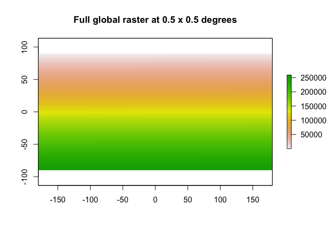
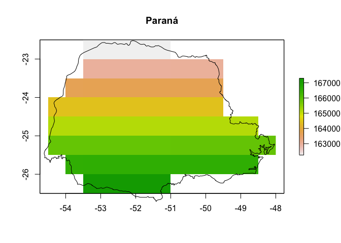
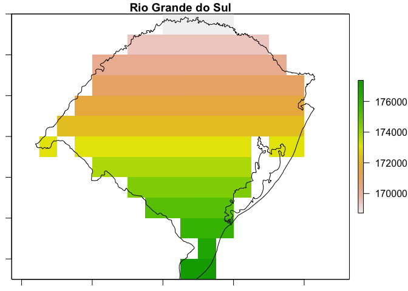

Using nasapower with large geographic areas, e.g. states
================

Fetching POWER data using `nasapower` for small, single queries is easy
and straightforward. However, if you wish to have daily data for a
larger area it can be trickier to implement.

Here I demonstrate fetching multiple seasons of rainfall data for two
states in Brazil using `nasapower`.

## Load libraries

To get the rainfall data for the states in Brazil, we will use
`nasapower` (Sparks 2019), `rnaturalearth` (South 2017) and `raster`
(Hijmans 2019) packages as well as `dplyr` (Wickham et al. 2019) for
data manipulation.

``` r
if (!require(devtools)) {
  install.packages("devtools")
  library(devtools)
}
if (!require(rnaturalearth)) {
  install.packages("rnaturalearth", dep = TRUE)
  library(rnaturalearth)
}
if (!require(rnaturalearth)) {
  install.packages("rnaturalearthhires",
                   repos = "http://packages.ropensci.org",
                   type = "source")
}
if (!require(raster)) {
  install.packages("raster", dep = TRUE)
  library(raster)
}
if (!require(dplyr)) {
  install.packages("dplyr", dep = TRUE)
  library(dplyr)
}
if (!require(nasapower)) {
  install.packages("nasapower", dep = TRUE)
  library(nasapower)
}
```

## Data import

To get the state data we will use `rnaturalearth` to download simple
features data for Brazil and subset the states Rio Grande do Sul and
Paraná into separate objects.

``` r
BRA <- ne_states(country = "Brazil",
                 returnclass = "sf")

# subset spatial objects of only the states of interest
RS <- BRA[BRA$name_en == "Rio Grande do Sul", ]
PR <- BRA[BRA$name_en == "Paraná", ]
```

## Get the rainfall data

Now that we have objects for the states we can create a raster grid to
represent the 0.5 x 0.5 degree grid that is the NASA-POWER data and
select only cells that fall within the two states of interest.

### POWER source

Create a grid of 0.5 x 0.5 arc degrees and extract the x, y values from
it for each state to use the coordinates to query the POWER data.

``` r
# create a global 0.5 x 0.5 degree raster object
r <- raster(nrows = 360,
            ncols = 720,
            xmn = -180,
            xmx = 180,
            ymn = -90,
            ymx = 90,
            resolution = 0.5)

values(r) <- 1:ncell(r)

plot(r, main = "Full global raster at 0.5 x 0.5 degrees")
```

<!-- -->

``` r
# Extract the two states, first crop by bounding box, then mask the raster
# Since raster doesn't play nice with `sf` yet we need to convert the objects
# to spatial data frames, which we do in-operation using `as()`
PR_coords <- crop(r, as(PR, "Spatial"))
RS_coords <- crop(r, as(RS, "Spatial"))

PR_coords <- mask(PR_coords, PR)
plot(PR_coords, main = "Paraná")
plot(PR, col = NA, add = TRUE)
```

<!-- -->

``` r
RS_coords <- mask(RS_coords, RS)
plot(RS_coords, main = "Rio Grande do Sul")
plot(RS, col = NA, add = TRUE)
```

<!-- -->

``` r
# extract the centroid values of the cells to use querying the POWER data
PR_coords <- as.data.frame(xyFromCell(PR_coords, 1:ncell(PR_coords)))
RS_coords <- as.data.frame(xyFromCell(RS_coords, 1:ncell(RS_coords)))
names(PR_coords) <- names(RS_coords) <- c("LON", "LAT")
coords <- rbind(PR_coords, RS_coords)
names(coords) <- c("lon", "lat")
```

**WARNING** This step is time intensive. **WARNING**

Using nested `for` loops, query the NASA-POWER database to gather
precipitation data for the states where rust was reported and save a CSV
file of the rainfall.

``` r
power <- vector(mode = "list", 4) # hold four growing seasons
precip <- vector(mode = "list", nrow(coords)) # hold the cells

seasons <- list(
  c("2014-11-01", "2015-01-31"),
  c("2015-11-01", "2016-01-31"),
  c("2016-11-01", "2017-01-31"),
  c("2017-11-01", "2018-01-31")
)

for (i in seq_along(seasons)) {
  # four seasons (outer loop 4x)
  season <- seasons[[i]]
  
  for (j in seq_along(1:nrow(coords))) {
    # 312 coordinate pairs (inner loop 312x)
    site <- as.numeric(coords[j, ])
    power_precip <- get_power(
      community = "AG",
      lonlat = site,
      pars = "PRECTOT",
      dates = season,
      temporal_average = "DAILY"
    )
    precip[[j]] <- power_precip
    Sys.sleep(5) # wait 5 seconds between requests so we don't hammer the server
  }
  precip <- bind_rows(power_precip)
  power[[i]] <- precip
}

power <- bind_rows(power)

write.csv(power, "power_data.csv", row.names = FALSE)
```

## Acknowledgements

> These data were obtained from the NASA Langley Research Center POWER
> Project funded through the NASA Earth Science Directorate Applied
> Science Program.

## References

Robert J. Hijmans (2019). raster: Geographic Data Analysis and Modeling.
R package version 3.0-2. <https://CRAN.R-project.org/package=raster>

South A (2017). *rnaturalearth: World Map Data from Natural Earth*. R
package version 0.1.0.
<https://CRAN.R-project.org/package=rnaturalearth>

Sparks, Adam (2018). nasapower: A NASA POWER Global Meteorology, Surface
Solar Energy and Climatology Data Client for R. Journal of Open Source
Software, 3(30), 1035, <https://doi.org/10.21105/joss.01035>

Sparks A (2019). *nasapower: NASA-POWER Data from R*. R package version
1.1.2, \<URL: <https://CRAN.R-project.org/package=nasapower>\>.

Hadley Wickham, Romain François, Lionel Henry and Kirill Müller (2019).
dplyr: A Grammar of Data Manipulation. R package version 0.8.3.
<https://CRAN.R-project.org/package=dplyr>

## Session information

``` r
sessioninfo::session_info()
```

    ## ─ Session info ──────────────────────────────────────────────────────────
    ##  setting  value                       
    ##  version  R version 3.6.1 (2019-07-05)
    ##  os       macOS Mojave 10.14.6        
    ##  system   x86_64, darwin15.6.0        
    ##  ui       X11                         
    ##  language (EN)                        
    ##  collate  en_AU.UTF-8                 
    ##  ctype    en_AU.UTF-8                 
    ##  tz       Australia/Brisbane          
    ##  date     2019-09-20                  
    ## 
    ## ─ Packages ──────────────────────────────────────────────────────────────
    ##  package            * version    date       lib
    ##  assertthat           0.2.1      2019-03-21 [1]
    ##  backports            1.1.4      2019-04-10 [1]
    ##  callr                3.3.1      2019-07-18 [1]
    ##  class                7.3-15     2019-01-01 [1]
    ##  classInt             0.4-1      2019-08-06 [1]
    ##  cli                  1.1.0      2019-03-19 [1]
    ##  codetools            0.2-16     2018-12-24 [1]
    ##  crayon               1.3.4      2017-09-16 [1]
    ##  DBI                  1.0.0      2018-05-02 [1]
    ##  desc                 1.2.0      2018-05-01 [1]
    ##  devtools           * 2.2.0      2019-09-07 [1]
    ##  digest               0.6.20     2019-07-04 [1]
    ##  dplyr              * 0.8.3      2019-07-04 [1]
    ##  DT                   0.8        2019-08-07 [1]
    ##  e1071                1.7-2      2019-06-05 [1]
    ##  ellipsis             0.2.0.1    2019-07-02 [1]
    ##  evaluate             0.14       2019-05-28 [1]
    ##  fs                   1.3.1      2019-05-06 [1]
    ##  glue                 1.3.1      2019-03-12 [1]
    ##  htmltools            0.3.6      2017-04-28 [1]
    ##  htmlwidgets          1.3        2018-09-30 [1]
    ##  KernSmooth           2.23-15    2015-06-29 [1]
    ##  knitr                1.24       2019-08-08 [1]
    ##  lattice              0.20-38    2018-11-04 [1]
    ##  magrittr             1.5        2014-11-22 [1]
    ##  memoise              1.1.0      2017-04-21 [1]
    ##  nasapower          * 1.1.2      2019-09-07 [1]
    ##  pillar               1.4.2      2019-06-29 [1]
    ##  pkgbuild             1.0.5      2019-08-26 [1]
    ##  pkgconfig            2.0.2      2018-08-16 [1]
    ##  pkgload              1.0.2      2018-10-29 [1]
    ##  prettyunits          1.0.2      2015-07-13 [1]
    ##  processx             3.4.1      2019-07-18 [1]
    ##  ps                   1.3.0      2018-12-21 [1]
    ##  purrr                0.3.2      2019-03-15 [1]
    ##  R6                   2.4.0      2019-02-14 [1]
    ##  raster             * 3.0-2      2019-08-22 [1]
    ##  Rcpp                 1.0.2      2019-07-25 [1]
    ##  remotes              2.1.0      2019-06-24 [1]
    ##  rgdal                1.4-4      2019-05-29 [1]
    ##  rgeos                0.5-1      2019-08-05 [1]
    ##  rlang                0.4.0      2019-06-25 [1]
    ##  rmarkdown            1.15       2019-08-21 [1]
    ##  rnaturalearth      * 0.1.0      2017-03-21 [1]
    ##  rnaturalearthhires   0.2.0      2019-08-13 [1]
    ##  rprojroot            1.3-2      2018-01-03 [1]
    ##  sessioninfo          1.1.1      2018-11-05 [1]
    ##  sf                   0.7-7      2019-07-24 [1]
    ##  sp                 * 1.3-1      2018-06-05 [1]
    ##  stringi              1.4.3      2019-03-12 [1]
    ##  stringr              1.4.0      2019-02-10 [1]
    ##  testthat             2.2.1      2019-07-25 [1]
    ##  tibble               2.1.3      2019-06-06 [1]
    ##  tidyselect           0.2.5      2018-10-11 [1]
    ##  units                0.6-4      2019-08-22 [1]
    ##  usethis            * 1.5.1.9000 2019-09-16 [1]
    ##  withr                2.1.2      2018-03-15 [1]
    ##  xfun                 0.9        2019-08-21 [1]
    ##  yaml                 2.2.0      2018-07-25 [1]
    ##  source                        
    ##  CRAN (R 3.6.0)                
    ##  CRAN (R 3.6.0)                
    ##  CRAN (R 3.6.0)                
    ##  CRAN (R 3.6.1)                
    ##  CRAN (R 3.6.0)                
    ##  CRAN (R 3.6.0)                
    ##  CRAN (R 3.6.1)                
    ##  CRAN (R 3.6.0)                
    ##  CRAN (R 3.6.0)                
    ##  CRAN (R 3.6.0)                
    ##  CRAN (R 3.6.0)                
    ##  CRAN (R 3.6.0)                
    ##  CRAN (R 3.6.0)                
    ##  CRAN (R 3.6.0)                
    ##  CRAN (R 3.6.0)                
    ##  CRAN (R 3.6.0)                
    ##  CRAN (R 3.6.0)                
    ##  CRAN (R 3.6.0)                
    ##  CRAN (R 3.6.0)                
    ##  CRAN (R 3.6.0)                
    ##  CRAN (R 3.6.0)                
    ##  CRAN (R 3.6.1)                
    ##  CRAN (R 3.6.0)                
    ##  CRAN (R 3.6.1)                
    ##  CRAN (R 3.6.0)                
    ##  CRAN (R 3.6.0)                
    ##  CRAN (R 3.6.0)                
    ##  CRAN (R 3.6.0)                
    ##  CRAN (R 3.6.0)                
    ##  CRAN (R 3.6.0)                
    ##  CRAN (R 3.6.0)                
    ##  CRAN (R 3.6.0)                
    ##  CRAN (R 3.6.0)                
    ##  CRAN (R 3.6.0)                
    ##  CRAN (R 3.6.0)                
    ##  CRAN (R 3.6.0)                
    ##  CRAN (R 3.6.0)                
    ##  CRAN (R 3.6.0)                
    ##  CRAN (R 3.6.0)                
    ##  CRAN (R 3.6.0)                
    ##  CRAN (R 3.6.0)                
    ##  CRAN (R 3.6.0)                
    ##  CRAN (R 3.6.0)                
    ##  CRAN (R 3.6.0)                
    ##  local                         
    ##  CRAN (R 3.6.0)                
    ##  CRAN (R 3.6.0)                
    ##  CRAN (R 3.6.0)                
    ##  CRAN (R 3.6.0)                
    ##  CRAN (R 3.6.0)                
    ##  CRAN (R 3.6.0)                
    ##  CRAN (R 3.6.0)                
    ##  CRAN (R 3.6.0)                
    ##  CRAN (R 3.6.0)                
    ##  CRAN (R 3.6.0)                
    ##  Github (r-lib/usethis@a2342b8)
    ##  CRAN (R 3.6.0)                
    ##  CRAN (R 3.6.0)                
    ##  CRAN (R 3.6.0)                
    ## 
    ## [1] /Library/Frameworks/R.framework/Versions/3.6/Resources/library
